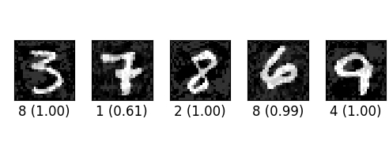

# Adversarial Attack with Chainer

Two [adversarial image](https://arxiv.org/abs/1312.6199)crafting algorithms are implemented with Chainer.
The two attacking algorithms can be found in attacks folder.

## Requirements

- Python 3.5+
- [Chainer](https://github.com/pfnet/chainer) 2.0.1+
- [CuPy](https://github.com/cupy/cupy) 1.0.1+
- Matplotlib

## Usage

```
$ python demo.py --gpu gpu
```

- Exapmles generated by Fast Gradient Sign Method (iterative)



## References
- [1]: [Explaining and Harnessing Adversarial Examples](https://arxiv.org/abs/1412.6572), Goodfellow et al., CoRR2014
- [2]: [Adversarial examples in the physical world](https://arxiv.org/abs/1607.02533), Kurakin et al., ICLR2017

## Related Work
- [1]: [Cleverhans ](https://github.com/tensorflow/cleverhans)
- [2]: [Implementation in tensorflow](https://github.com/gongzhitaao/tensorflow-adversarial)
